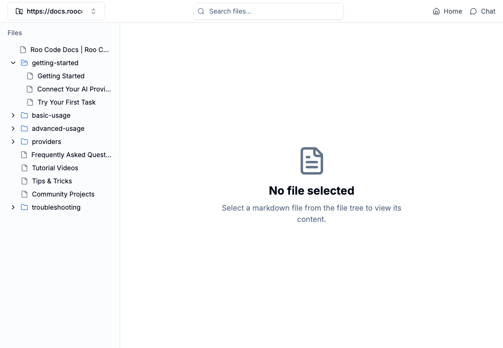
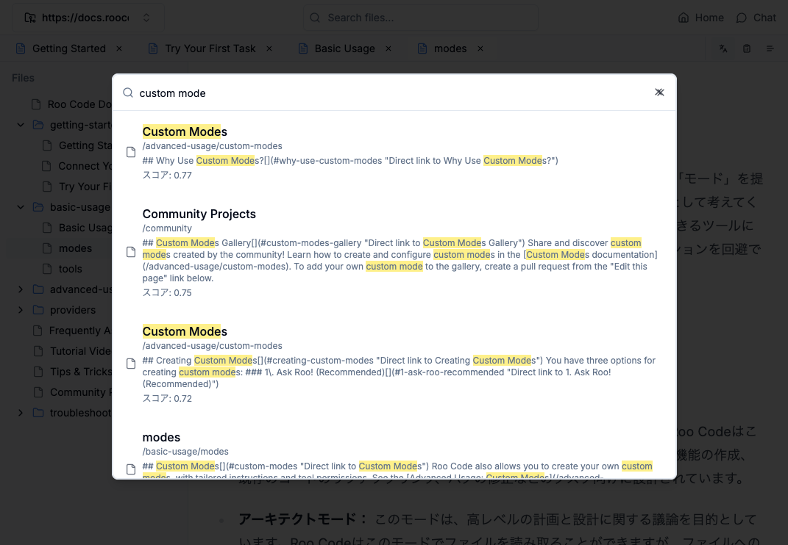
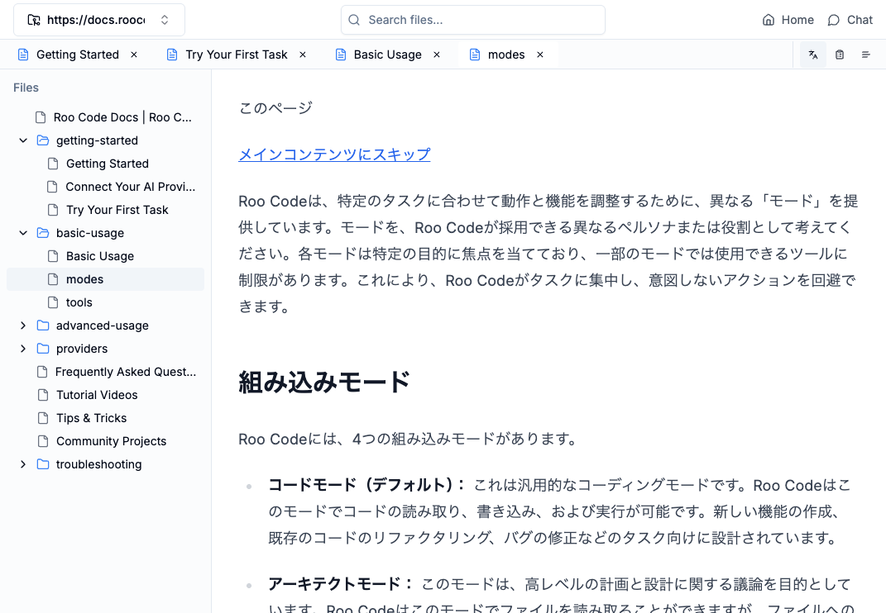
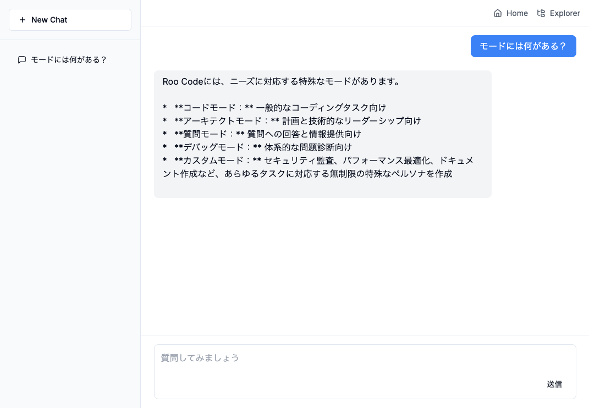

# Webドキュメント翻訳・要約・検索システム

## ツール概要

本ツールは、Web上に公開されている公式ドキュメントを翻訳・要約し、検索可能な形で管理するシステムを提供します。CLIツールを使用してドキュメントを収集・翻訳を行います。

## 主な機能

- Webコンテンツの探索・翻訳・要約
- Qdrantによるベクトル検索
- Google Gemini APIを活用した翻訳・要約・RAG検索
- ローカルフォルダ内のファイル処理（`input/`フォルダ対応）- 未実装

## スクリーンショット

### ファイルツリー


### Qdrantによるベクトル検索 


### 翻訳・要約・元テキスト閲覧


### RAG


## 使用技術

- **言語**: TypeScript
- **CLI実行環境**: Node.js
- **Webアプリ**: Next.js
- **データ管理**: Qdrant
- **埋め込みモデル**: Google Gemini API
- **検索エンジン**: Qdrant

## セットアップ

### 必要条件

- Node.js
- Docker

### 実行

#### Docker Composeの使用

Docker Composeをベクターデータベースqdrantを起動します

```sh
docker-compose up
```

#### CLIツールの使用

先にCLIツールからデータの登録が必要です

cliフォルダのREADME.mdを参照してください。

#### Webアプリの起動

webフォルダのREADME.mdを参照してください。


