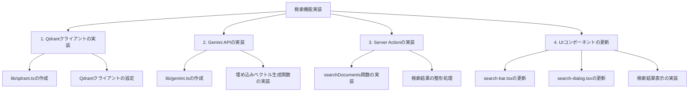

# 検索機能実装計画

## 現状分析

### 既存のコンポーネント
- **search-bar.tsx**: 検索バーのUIコンポーネント（実装済み）
- **search-dialog.tsx**: 検索結果表示のUIコンポーネント（実装済み、現在はサンプルデータを使用）

### 未実装のモジュール
- **lib/qdrant.ts**: Qdrantクライアントの実装（未実装）
- **lib/gemini.ts**: Google Gemini APIを使用した埋め込みベクトル生成（未実装）

### データベース関連
- **lib/db.ts**: SQLiteデータベース接続（実装済み）
- **server-actions/repository.ts**: データベースからのデータ取得関数（実装済み、検索機能は未実装）

### ドメインモデル
- **domain/translation.ts**: 翻訳データのモデル（実装済み）
- **domain/project.ts**: プロジェクト情報のモデル（実装済み）
- **domain/file-tree.ts**: ファイルツリー情報のモデル（実装済み）

### データベース構造
- **projects**: プロジェクト情報を管理するテーブル
- **file_trees**: ファイルツリー情報を管理するテーブル
- **translations**: 翻訳データを管理するテーブル
- **vectors**: ベクトルデータをQdrantで管理（コレクション名: vector_collection）

## 実装計画



### 1. Qdrantクライアントの実装

#### 1.1 lib/qdrant.tsの作成
```typescript
import { QdrantClient } from "@qdrant/js-client-rest";

// Qdrantクライアントの設定
const qdrantClient = new QdrantClient({
  url: process.env.QDRANT_URL || "http://localhost:6333",
  apiKey: process.env.QDRANT_API_KEY,
});

// ベクトル検索関数
export async function searchVectors(
  vector: number[],
  projectId: string,
  topK: number = 5
) {
  try {
    return await qdrantClient.search("vector_collection", {
      vector,
      top_k: topK,
      filter: {
        must: [{ key: "project_id", match: { value: projectId } }]
      }
    });
  } catch (error) {
    console.error("Error in searchVectors:", error);
    return [];
  }
}

export { qdrantClient };
```

### 2. Gemini APIの実装

#### 2.1 lib/gemini.tsの作成
```typescript
import { GoogleGenerativeAI } from "@google/generative-ai";

// Google Gemini APIの設定
const genAI = new GoogleGenerativeAI(process.env.GEMINI_API_KEY || "");
const embeddingModel = genAI.getGenerativeModel({ model: "embedding-001" });

// テキストを埋め込みベクトルに変換する関数
export async function getEmbedding(text: string): Promise<number[]> {
  try {
    const result = await embeddingModel.embedContent(text);
    const embedding = result.embedding.values;
    return embedding;
  } catch (error) {
    console.error("Error in getEmbedding:", error);
    throw new Error("Failed to generate embedding");
  }
}
```

### 3. Server Actionの実装

#### 3.1 server-actions/search.tsの作成
```typescript
"use server";

import { qdrantClient, searchVectors } from "@/lib/qdrant";
import { getEmbedding } from "@/lib/gemini";
import { revalidatePath } from "next/cache";
import db from "@/lib/db";
import { TranslationEntry } from "@/domain/translation";
import { FileTreeEntry } from "@/domain/file-tree";

// 検索結果の型定義
export interface SearchResult {
  id: string;
  title: string;
  category: string;
  path: string;
  type: "file" | "folder";
  score: number;
  summary?: string;
  children?: SearchResult[];
}

export async function searchDocuments(formData: FormData): Promise<SearchResult[]> {
  const query = formData.get("query") as string;
  const projectId = formData.get("projectId") as string;
  const topK = Number(formData.get("topK")) || 5;

  if (!query) {
    throw new Error("検索クエリが必要です。");
  }

  if (!projectId) {
    throw new Error("プロジェクトIDが必要です。");
  }

  try {
    // 1. クエリを埋め込みベクトルに変換
    const vector = await getEmbedding(query);

    // 2. Qdrantに検索リクエスト送信
    const searchResults = await searchVectors(vector, projectId, topK);

    if (!searchResults.length) {
      return [];
    }

    // 3. 取得した結果からresource_idを抽出
    const resourceIds = searchResults.map(result => result.payload.resource_id as string);

    // 4. resource_idとproject_idを検索条件にfile_treesテーブルからマッチしたレコードを取得
    const fileTrees = await Promise.all(
      resourceIds.map(async (resourceId) => {
        return await db
          .prepare(
            `SELECT
              id,
              project_id,
              resource_id,
              domain,
              name,
              type,
              path,
              parent
            FROM file_trees
            WHERE resource_id = ? AND project_id = ?`
          )
          .get(resourceId, projectId) as FileTreeEntry | undefined;
      })
    );

    // 5. resource_idを条件にtranslationsテーブルからマッチしたレコードを取得
    const translations = await Promise.all(
      resourceIds.map(async (resourceId) => {
        return await db
          .prepare(
            `SELECT
              id,
              resource_id,
              title,
              summary,
              description,
              text,
              original_text,
              language,
              keywords,
              timestamp
            FROM translations
            WHERE resource_id = ?`
          )
          .get(resourceId) as TranslationEntry | undefined;
      })
    );

    // 6. 検索結果を整形
    const results: SearchResult[] = searchResults.map((result, index) => {
      const fileTree = fileTrees[index];
      const translation = translations[index];
      
      if (!fileTree || !translation) {
        return null;
      }

      return {
        id: fileTree.id,
        title: translation.title,
        category: fileTree.path,
        path: fileTree.path,
        type: fileTree.type,
        score: result.score,
        summary: translation.summary,
      };
    }).filter(Boolean) as SearchResult[];

    // 7. キャッシュをリフレッシュ
    revalidatePath("/search");

    return results;
  } catch (error) {
    console.error("Error in searchDocuments:", error);
    throw new Error("検索処理中にエラーが発生しました。");
  }
}
```

### 4. UIコンポーネントの更新

#### 4.1 search-bar.tsxの更新
```typescript
"use client"

import { useState } from "react"
import { Search } from "lucide-react"
import { Input } from "@/components/ui/input"
import { SearchDialog } from "@/components/search-dialog"
import { useParams } from "next/navigation"

export function SearchBar() {
  const [open, setOpen] = useState(false)
  const [searchQuery, setSearchQuery] = useState("")
  const params = useParams()
  const projectId = params.id as string

  return (
    <>
      <div className="relative w-80" onClick={() => setOpen(true)}>
        <Search className="absolute left-2 top-1/2 h-4 w-4 -translate-y-1/2 transform text-muted-foreground" />
        <Input type="search" placeholder="Search files..." className="pl-8 cursor-pointer" readOnly />
      </div>

      <SearchDialog 
        open={open} 
        onOpenChange={setOpen} 
        searchQuery={searchQuery} 
        onSearchQueryChange={setSearchQuery}
        projectId={projectId}
      />
    </>
  )
}
```

#### 4.2 search-dialog.tsxの更新
```typescript
"use client"

import * as React from "react"
import { File, FolderOpen, ChevronRight, X, Search } from "lucide-react"
import { cn } from "@/lib/utils"
import { Dialog, DialogContent } from "@/components/ui/dialog"
import { searchDocuments, SearchResult } from "@/server-actions/search"
import { useToast } from "@/hooks/use-toast"

interface SearchDialogProps {
  open: boolean
  onOpenChange: (open: boolean) => void
  searchQuery: string
  onSearchQueryChange: (query: string) => void
  projectId: string
}

export function SearchDialog({ 
  open, 
  onOpenChange, 
  searchQuery, 
  onSearchQueryChange,
  projectId
}: SearchDialogProps) {
  const [results, setResults] = React.useState<SearchResult[]>([])
  const [isLoading, setIsLoading] = React.useState(false)
  const inputRef = React.useRef<HTMLInputElement>(null)
  const { toast } = useToast()

  // Focus input when dialog opens
  React.useEffect(() => {
    if (open && inputRef.current) {
      setTimeout(() => {
        inputRef.current?.focus()
      }, 0)
    }
  }, [open])

  // Handle search
  const handleSearch = async (e: React.FormEvent) => {
    e.preventDefault()
    
    if (!searchQuery.trim()) {
      setResults([])
      return
    }

    setIsLoading(true)

    try {
      const formData = new FormData()
      formData.append("query", searchQuery)
      formData.append("projectId", projectId)
      formData.append("topK", "5")

      const searchResults = await searchDocuments(formData)
      setResults(searchResults)
    } catch (error) {
      console.error("Search error:", error)
      toast({
        title: "検索エラー",
        description: error instanceof Error ? error.message : "検索中にエラーが発生しました。",
        variant: "destructive",
      })
      setResults([])
    } finally {
      setIsLoading(false)
    }
  }

  return (
    <Dialog open={open} onOpenChange={onOpenChange}>
      <DialogContent className="max-w-3xl gap-0 p-0">
        <div className="rounded-lg border shadow-md">
          <form onSubmit={handleSearch} className="flex items-center border-b px-3">
            <Search className="h-4 w-4 text-muted-foreground" />
            <input
              ref={inputRef}
              value={searchQuery}
              onChange={(e) => onSearchQueryChange(e.target.value)}
              placeholder="Search documentation..."
              className="h-12 flex-1 bg-transparent px-2 text-sm outline-none placeholder:text-muted-foreground"
            />
            {searchQuery && (
              <button
                type="button"
                onClick={() => onSearchQueryChange("")}
                className="ml-2 rounded-sm opacity-70 ring-offset-background transition-opacity hover:opacity-100"
              >
                <X className="h-4 w-4" />
                <span className="sr-only">Clear search</span>
              </button>
            )}
            <button type="submit" className="sr-only">Search</button>
          </form>
          <div className="max-h-[500px] overflow-y-auto p-2">
            {isLoading ? (
              <div className="py-6 text-center">
                <div className="inline-block h-6 w-6 animate-spin rounded-full border-2 border-current border-t-transparent"></div>
                <p className="mt-2 text-sm text-muted-foreground">検索中...</p>
              </div>
            ) : (
              <>
                {results.length === 0 && searchQuery && (
                  <div className="py-6 text-center text-sm text-muted-foreground">検索結果がありません。</div>
                )}
                {results.map((result) => (
                  <ResultItem key={result.id} item={result} searchQuery={searchQuery} />
                ))}
              </>
            )}
          </div>
        </div>
      </DialogContent>
    </Dialog>
  )
}

interface ResultItemProps {
  item: SearchResult
  searchQuery: string
  level?: number
}

function ResultItem({ item, searchQuery, level = 0 }: ResultItemProps) {
  const [isExpanded, setIsExpanded] = React.useState(true)
  const hasChildren = item.children && item.children.length > 0

  // Highlight matching text
  const highlightText = (text: string) => {
    if (!searchQuery) return text

    const regex = new RegExp(`(${searchQuery})`, "gi")
    const parts = text.split(regex)

    return (
      <>
        {parts.map((part, i) => {
          if (part.toLowerCase() === searchQuery.toLowerCase()) {
            return (
              <span key={i} className="bg-yellow-200 dark:bg-yellow-800">
                {part}
              </span>
            )
          }
          return part
        })}
      </>
    )
  }

  return (
    <>
      <button
        className={cn(
          "flex w-full cursor-pointer items-center rounded-sm px-2 py-1.5 text-sm hover:bg-accent",
          level > 0 && "ml-4",
        )}
        onClick={() => hasChildren && setIsExpanded(!isExpanded)}
      >
        <div className="flex flex-1 items-center gap-2">
          {item.type === "folder" ? (
            <FolderOpen className="h-4 w-4 shrink-0 text-blue-500" />
          ) : (
            <File className="h-4 w-4 shrink-0 text-gray-500" />
          )}
          <div className="flex flex-col text-left">
            <div className="font-medium">{highlightText(item.title)}</div>
            <div className="text-xs text-muted-foreground">{item.category}</div>
            {item.summary && (
              <div className="text-xs text-muted-foreground mt-1">{highlightText(item.summary)}</div>
            )}
          </div>
        </div>
        {hasChildren && (
          <ChevronRight
            className={cn(
              "ml-auto h-4 w-4 shrink-0 text-muted-foreground transition-transform",
              isExpanded && "rotate-90",
            )}
          />
        )}
      </button>
      {hasChildren &&
        isExpanded &&
        item.children?.map((child) => (
          <ResultItem key={child.id} item={child} searchQuery={searchQuery} level={level + 1} />
        ))}
    </>
  )
}
```

### 5. 必要なパッケージのインストール

以下のパッケージをインストールする必要があります：

```bash
npm install @qdrant/js-client-rest @google/generative-ai
# または
yarn add @qdrant/js-client-rest @google/generative-ai
# または
pnpm add @qdrant/js-client-rest @google/generative-ai
```

## 実装の流れ

1. 必要なパッケージのインストール
2. lib/qdrant.ts と lib/gemini.ts の実装
3. server-actions/search.ts の実装
4. search-bar.tsx と search-dialog.tsx の更新
5. 動作確認とデバッグ

この計画に基づいて実装を進めることで、Qdrantを使用した検索機能を実現できます。